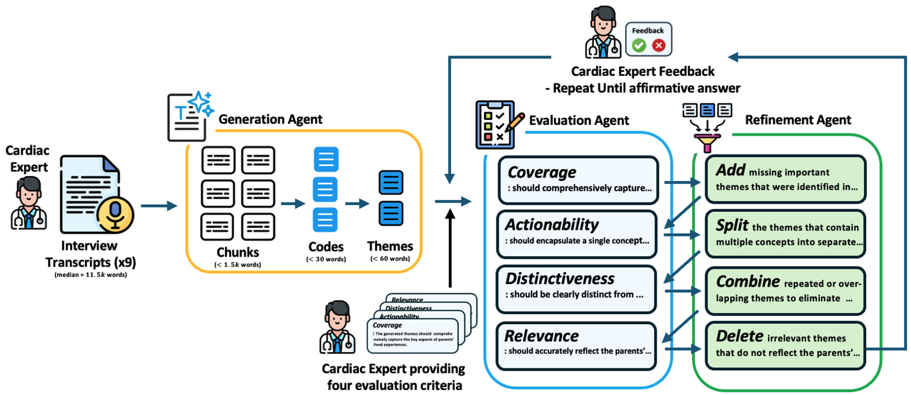

# TAMA: Human–AI Collaborative Thematic Analysis using Multi-Agent LLMs


## Overview

TAMA is a human–AI collaborative framework for inductive thematic analysis of long, qualitative clinical interview transcripts. It uses a structured multi-agent workflow—Generation, Evaluation, and Refinement agents—combined with clinician-defined criteria to produce accurate, distinct, and clinically relevant themes. The framework reduces manual coding times by more than 99% while improving thematic coverage, distinctiveness, and alignment with expert-generated themes. TAMA was evaluated on de-identified interviews from parents of children with congenital heart disease and outperformed single-agent LLM baselines across multiple quantitative metrics.

## Quick Start

**Get started in 5 minutes!** See [QUICKSTART.md](QUICKSTART.md) for detailed instructions.

```bash
pip install -r requirements.txt
export OPENAI_API_KEY='your-api-key'
python example_usage.py
```

## Key Features

- Multi-agent LLM architecture with coordinated Generation, Evaluation, and Refinement agents.
- Human-in-the-loop design with clinician-defined goals, evaluation criteria, and final approval.
- Quantitative evaluation using Jaccard similarity, hit rate, and embedding-based cosine similarity.
- End-to-end thematic analysis completed in under ten minutes, reducing manual workload by more than 99%.

## Architecture

The TAMA framework uses a multi-agent workflow consisting of Generation, Evaluation, and Refinement agents, with iterative oversight from a clinical expert. The expert provides initial goals and evaluation criteria and makes the final decision to accept or revise the generated themes.

### Workflow Diagram


## Installation

### Prerequisites
- Python 3.10 or higher
- OpenAI API key

### Quick Setup

```bash
# Clone repository
git clone https://github.com/yourusername/TAMA.git
cd TAMA

# Install dependencies
pip install -r requirements.txt

# Set API key
export OPENAI_API_KEY='your-api-key-here'

# Run example
python example_usage.py
```

For detailed installation instructions, see [INSTALLATION.md](INSTALLATION.md).

## Usage

### Basic Example

```python
import os
from src.tama import TAMAFramework, load_transcript

# Initialize framework
tama = TAMAFramework(
    api_key=os.getenv("OPENAI_API_KEY"),
    model="gpt-4o",
    max_iterations=5,
    acceptance_threshold=4.0
)

# Load transcript and run analysis
transcript = load_transcript("data/your_transcript.txt")
result = tama.run_analysis(
    transcript=transcript,
    session_name="my_analysis",
    save_intermediate=True
)

# Access results
print(f"Generated {len(result['final_themes'])} themes")
print(f"Final score: {result['metadata']['final_average_score']:.2f}/5.0")
```

### Custom Evaluation Criteria

```python
# Define domain-specific criteria from clinical experts
expert_criteria = {
    "coverage": "should comprehensively capture all important patterns",
    "actionability": "should encapsulate a single, clear concept",
    "distinctiveness": "should be clearly distinct from other themes",
    "relevance": "must accurately reflect participant experiences"
}

tama = TAMAFramework(
    api_key=api_key,
    expert_criteria=expert_criteria
)
```

### Output Structure

Results are saved to `outputs/[session_name]/`:
- `00_final_results.json` - Complete analysis results
- `00_summary.txt` - Human-readable summary
- `01_generation.json` - Initial generation output
- `02_evaluation_iter*.json` - Evaluation results per iteration
- `03_refinement_iter*.json` - Refinement operations per iteration

## Framework Components

### 1. Generation Agent
- **Chunking**: Splits transcripts into 3-5k word segments
- **Coding**: Extracts codes (<25 words) from each chunk
- **Theme Generation**: Synthesizes codes into themes (~25 words)

### 2. Evaluation Agent
Evaluates themes using four criteria:
- **Coverage**: Comprehensively captures important patterns
- **Actionability**: Encapsulates single, clear concept
- **Distinctiveness**: Clearly distinct from other themes
- **Relevance**: Accurately reflects the data

### 3. Refinement Agent
Refines themes using four operations:
- **Add**: Add missing important themes
- **Split**: Split themes containing multiple concepts
- **Combine**: Combine overlapping themes
- **Delete**: Delete irrelevant themes

### Iterative Process
The framework iterates through evaluation and refinement until:
- Themes achieve acceptance threshold (default: 4.0/5.0), OR
- Maximum iterations reached (default: 5)

## Citation

If you use TAMA in your research, please cite:

```bibtex
@misc{xu2025tamahumanaicollaborativethematic,
      title={TAMA: A Human-AI Collaborative Thematic Analysis Framework Using Multi-Agent LLMs for Clinical Interviews}, 
      author={Huimin Xu and Seungjun Yi and Terence Lim and Jiawei Xu and Andrew Well and Carlos Mery and Aidong Zhang and Yuji Zhang and Heng Ji and Keshav Pingali and Yan Leng and Ying Ding},
      year={2025},
      eprint={2503.20666},
      archivePrefix={arXiv},
      primaryClass={cs.HC},
      url={https://arxiv.org/abs/2503.20666}, 
}
